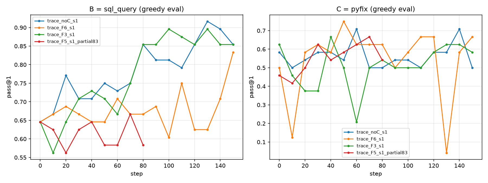

# Pilot phase-1 results

| run | evals | B final | B best | B AUC | tt@0.75 | tt@0.8 | tt@0.85 | C kept tok/step | C errrec early→late | C succ early→late |
|---|---|---|---|---|---|---|---|---|---|---|
| trace_noC_s1 | 16 | 0.8541666666666666 | 0.9166666666666666 | 0.785 | 18.0 | 75.0 | 80.0 | 0.0 | -→- | -→- |
| trace_F6_s1 | 16 | 0.8333333333333334 | 0.8333333333333334 | 0.673 | 110.0 | 147.0 | never | 13673.5 | 0.631→0.751 | 0.672→0.763 |
| trace_F3_s1 | 16 | 0.8541666666666666 | 0.8958333333333334 | 0.774 | 70.0 | 75.0 | 80.0 | 12859.0 | 0.69→0.685 | 0.713→0.707 |
| trace_F5_s1_partial83 | 9 | 0.5833333333333334 | 0.6666666666666666 | 0.613 | never | never | never | 13408.5 | 0.553→0.457 | 0.67→0.732 |

