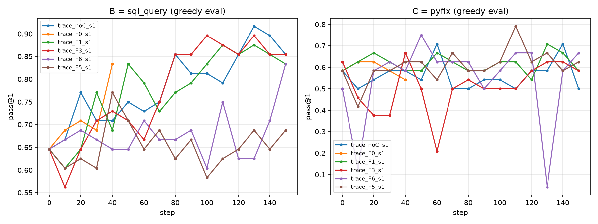

# Pilot phase-1 results

| run | evals | B final | B best | B AUC | tt@0.75 | tt@0.8 | tt@0.85 | C kept tok/step | C errrec early→late | C succ early→late |
|---|---|---|---|---|---|---|---|---|---|---|
| trace_noC_s1 | 16 | 0.8541666666666666 | 0.9166666666666666 | 0.785 | 18.0 | 75.0 | 80.0 | 0.0 | -→- | -→- |
| trace_F0_s1 | 5 | 0.8333333333333334 | 0.8333333333333334 | 0.706 | 34.0 | 38.0 | never | 0.0 | 0.471→0.49 | 0.512→0.5 |
| trace_F1_s1 | 16 | 0.8333333333333334 | 0.875 | 0.777 | 28.0 | 48.0 | 104.0 | 7109.8 | 0.697→0.704 | 0.71→0.712 |
| trace_F3_s1 | 16 | 0.8541666666666666 | 0.8958333333333334 | 0.774 | 70.0 | 75.0 | 80.0 | 12859.0 | 0.69→0.685 | 0.713→0.707 |
| trace_F6_s1 | 16 | 0.8333333333333334 | 0.8333333333333334 | 0.673 | 110.0 | 147.0 | never | 13673.5 | 0.631→0.751 | 0.672→0.763 |
| trace_F5_s1 | 16 | 0.6875 | 0.7708333333333334 | 0.653 | 39.0 | never | never | 18282.0 | 0.653→0.728 | 0.692→0.826 |

